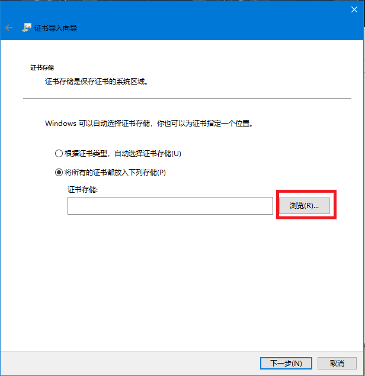

# 安装部署文档 
小组成员：cx cyx cyf cxy
## 安装环境
1. 本项目为UWP应用（Windows通用应用平台），所以本项目的安装环境应为Windows10。
2. 本项目应在旁加载应用模式下运行。（win10旁加载应用模式是针对开发者使用的一种运行环境模式，它能够在不通过微软应用商店，不受任何限制的安装和测试第三方应用的运行模式）
## 启用Windows 10 Sideload 
1. 使用 Windows + I 快捷键打开「设置」应用 
2. 导航到「更新和安全」—「针对开发人员」 
3. 将单选项调整选中「旁加载应用」 
 

## 解压

## 安装开发用的自签名证书
1. 双击鼠标打开目录下的``.cert``文件
2. 安装证书  

3. 选择为计算机安装  

4. 选择储存位置为受信任的根证书颁发机构  

5. 确认安装  

6. 信任自签名证书（不安全但必须）  

##  安装.appx文件 
1. 双击目录下的``.appx``文件
2. 确认安装  

