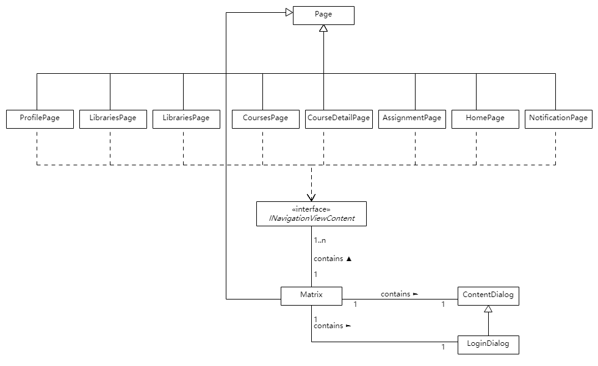

# 软件设计文档

本项目是基于中山大学数据科学与计算机学院编程教学网站[``VMatrix``](https://matrix.sysu.edu.cn)制作的一个第三方客户端。基于此前提，本项目的架构上部分依赖于``VMatrix``系统架构，所以下述内容中可能会有部分设计。本文档讲述客户端系统设计，不过多涉及``VMatrix``系统的部分。

## 技术选型

本项目采用通用 Windows  平台\(UWP\)作为客户端，配合 UWP 原生支持的 WebView 实现部分 UI

### 技术选型理由

主要基于以下几个考量：
1. 兼容性更强—— UWP 作为 Windows 新一代的应用程序架构平台，自诞生起就具有面向多种屏幕设备的设计，跨所有设备的通用 API 设计面，可以快速实现不同屏幕的适配。
2. 技术门槛较低—— UWP 应用可以使用 Windows 运行时，它是操作系统提供的本机 API。 此 API 通过 C++ 实现，并且在 C#、Visual Basic、C++ 和 JavaScript 中均受支持。 
3. ``MVVM``架构符合原有的``VMatrix``前端架构。

UWP 的弊端所在：
1. UI 设计局限性较大，通过 XAML 操作控件样式并不如 HTML + CSS 灵活，同时这方面的文档较少。
2. 相对冷门，比起普遍的 Web 前端来说，UWP 相对冷门，除去微软的官方文档和 MSDN 之外，第三方深入研究的博客较少。
3. 第三方控件较少，除去微软开源的社区控件库 [Windows Community Toolkit](https://github.com/Microsoft/WindowsCommunityToolkit) 之外，没有比较成熟的控件。

### 通过 WebView 补充功能
本次项目使用的代码编辑器并没有可用的 UWP 控件，为此采用了第三方通过 WebView 封装的代码编辑器 [Monaco](https://github.com/Microsoft/monaco-editor) 

## 架构设计

本项目采用 MVVM 架构，根据模型-视图-视图模型的结构来组织代码，同时包含了中间的数据转换层和其他提供服务的内容。

### 模型 Model
模型是数据实体的逻辑映射，包含了数据与与之对应的业务逻辑。由于``VMatrix``本身接口采用``RESTful``规范，所以接口返回的数据即是资源，所以模型根据网站的接口进行设计，主要包括课程，题库，题目，提交，通知等等。

### 视图 Views
视图负责定义用户在屏幕上所见的结构、布局和外观。视图负责界面和交互逻辑。  
映射到具体的结构上，是以各个页面的内容来划分代码。

### 视图模型 ViewModel
视图模型是视图与模型的桥梁。系统通过视图模型，将视图界面的内容同模型的数据联系起来。当数据变化的时候，视图模型负责将模型数据的变化反馈到用户界面。与 MVC 的 控制器不同的是，视图模型只处理视图与模型数据的交流，不会处理逻辑业务，只表示状态和对模型的操作。  
对于代码的结构而言，一个页面对应有一种视图模型，一种视图模型可能对应多种模型。

### 转换层与服务 Convertor, Services & Helper
#### 转换器
模型数据到视图的映射，可能需要进行数据转换。将此数据转换放在视图模型是一个不错的主意，因为它提供了该视图可以将绑定到的属性。  
但是，更好的建议是将数据的转换统一到一个转换层 Convertor，这样的好处有两点：
+ 关注点分离，视图模型专注与数据绑定。
+ 代码可复用性高，转换器的代码可以在不同的视图与视图模型之间复用。
微软的 UWP 文档更倾向于独立的数据转换层

#### 服务
服务包括两种，一是指单独提供功能的子系统，本项目中使用的 Sqlite 的管理即是一种服务，二是提供简单而独立于上述 MVVM 之外的功能，包括独立逻辑的封装如 HttpJsonRequest，或者接口的定义如 INavigationViewContent 和已弃用的 IHamburgerContent ，这一部分放在 Helpers 目录下。

## 模块划分

项目代码根据 MVVM 垂直组织，通过视图内容水平划分，主要包括三大部分：视图框架，弹出对话框，以及各个子视图模块。

### 视图框架
通过 NavigationView 实现，包含了跳转的导航菜单以及顶部的功能按钮，通过 Frame 实现子视图模块的切换。这个模块通过 INavigationViewContent 接口规定的事件和属性与 Frame 中的子视图模块进行数据交流，包括标题的设置以及错误处理等等。

### 弹出对话框
弹出对话框用于处理错误和用户登陆。

### 各个子视图模块
子视图模块包括主页，课程列表，课程详情，题目，题库列表，通知，个人设置等等。子模块实现了 INavigationViewContent 接口，通过事件通知父页面。

## 设计模式

* 单例模式：Service 部分的代码均采用了单例模式实现，这主要考虑到的是 Service 的属性均由全局决定，不需要过多的构造，只需要单个实例即可。请求的部分 MatrixRequest 也是采用单例模式，这是因为 cookie，CSRF-Token 的设置需要全局共享，所以数据只能存在一份。
* 代理模式：通过代理模式实现数据的请求。
* 面向对象的设计：面向对象的设计符合 UI 的构建。